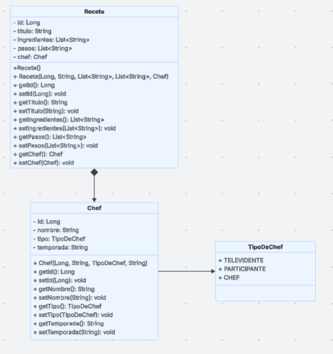
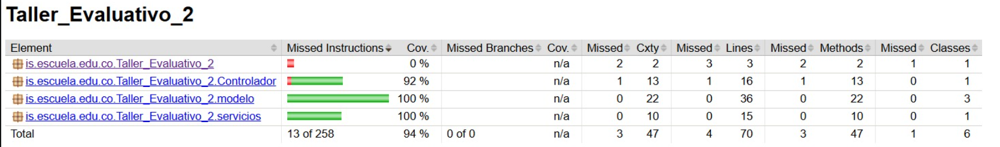
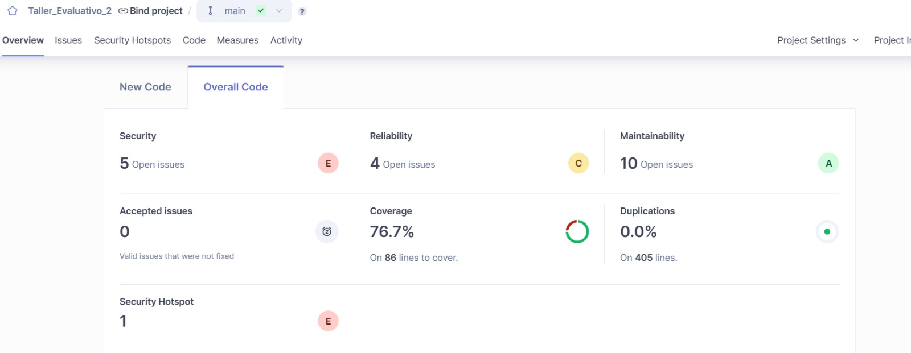
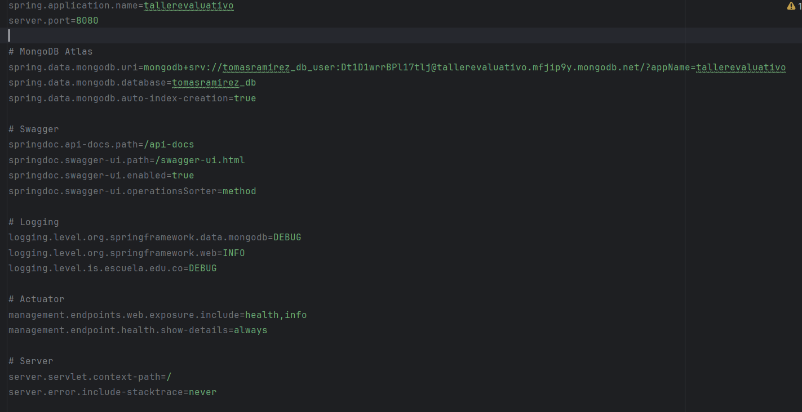
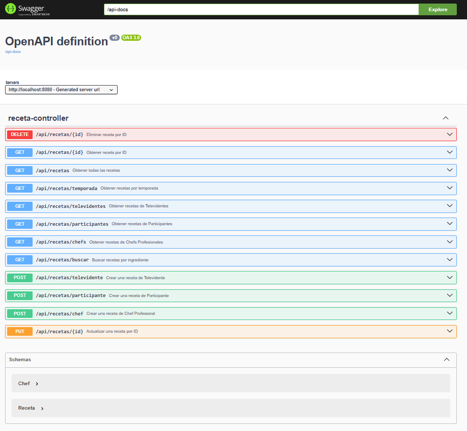
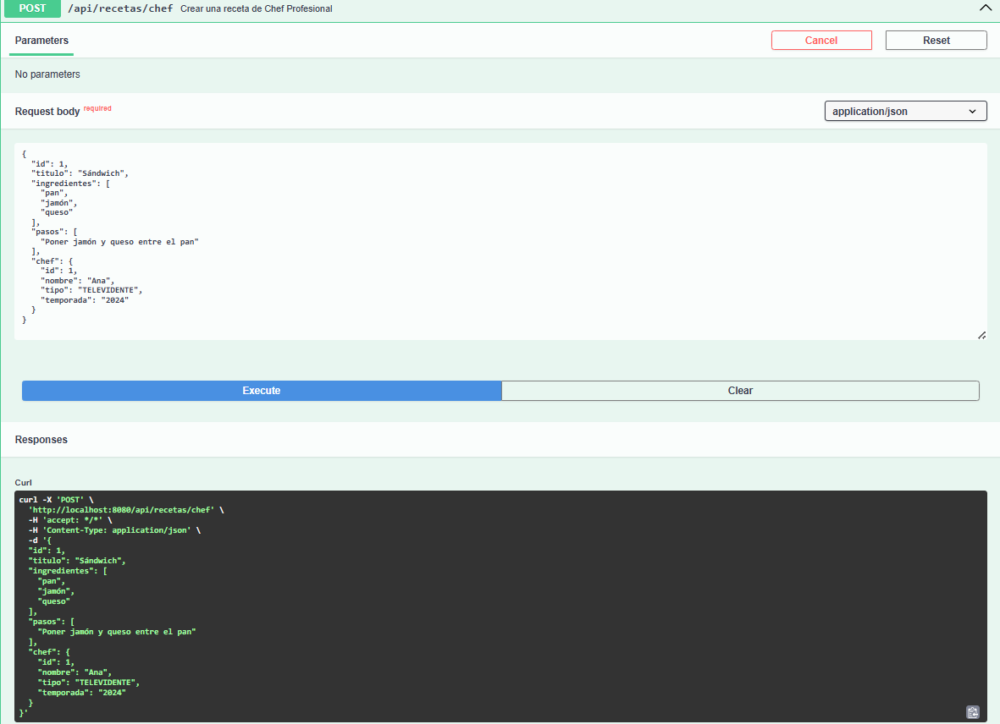
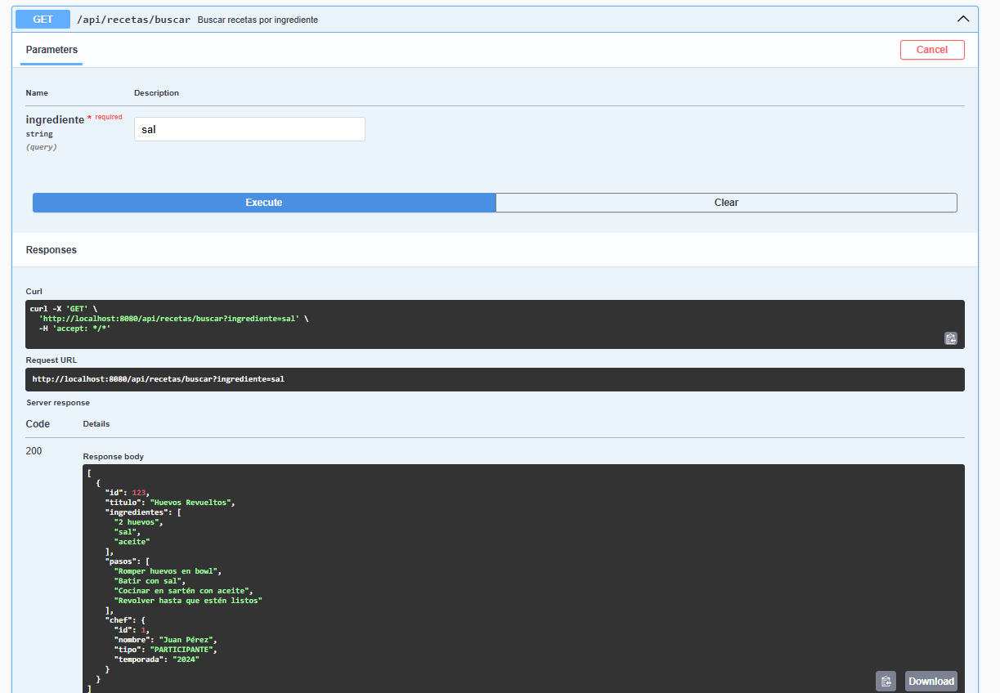
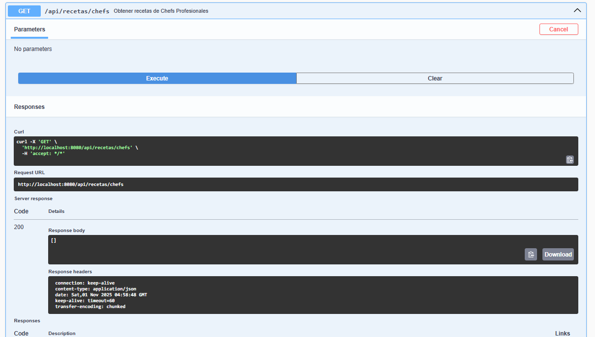
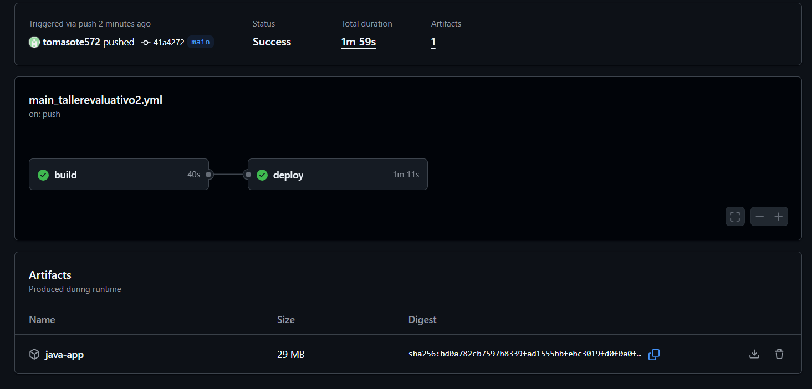
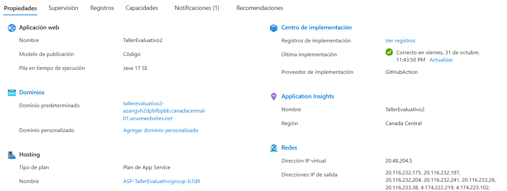

# Taller_Evaluativo_T2_2025-2

### Integrantes:
 - Tomas Felipe Ramirez Alvarez

Repositorio para el Taller Evaluativo 2 del curso de Ingeniería de Software II - 2025-2, el cual 
consiste en crear un show de master chell celebrity con diferentes tipos de chef que envian recetas, las cuales son 
gestionadas a traves de la api que estamos creando.

## Estructura de commits

- `src/main/java/is/escuela/edu/co/Taller_Evaluativo_2/Controlador` — Contiene los controladores y la lógica de servicio expuesta como endpoints.
- `src/main/java/is/escuela/edu/co/Taller_Evaluativo_2/modelo` — Contiene las clases del dominio (modelos) y utilidades relacionadas.

## Paquete Controlador

Clases principales:

- `RecetaController` — Controlador REST expuesto en recetas que delega la lógica a RecetaService.
  - Endpoints implementados :
    - POST `/recetas/Registrar receta de televidente` — registrar receta (televidente).
    - POST `/recetas/Registrar receta de participante` — registrar receta (participante).
    - POST `/recetas/Registrar receta de chef` — registrar receta (chef).
    - GET `/recetas` — listar todas las recetas.
    - GET `/recetas/Receta por ID` — obtener receta por ID (usa path variable).
    - GET `/recetas/Recetas de participantes` — obtener recetas de participantes.
    - GET `/recetas/Recetas de televidentes` — obtener recetas de televidentes.
    - GET `/recetas/Recetas de chefs` — obtener recetas de chefs.
    - GET `/recetas/Recetas por temporada` — obtener recetas por temporada (usa path variable).
    - GET `/recetas/Buscar por ingrediente` — buscar recetas por ingrediente (request param `ingrediente`).
    - DELETE `/recetas/Eliminar receta` — eliminar receta por ID (path variable).
    - PUT `/recetas/Actualizar receta` — actualizar receta por ID (path variable y body).

- RecetaService: 
  -  Servicio encargado de la lógica de negocio (guardado, búsqueda, filtro por tipo/temporada y demas).

## Paquete modelo



Clases principales que creadas y su responsabilidad:

- `Chef` — Representa a un chef o a un autor de una receta.
  - Atributos: `id`, `nombre`, `tipo` (enum `TipoDeChef`), `temporada`.
  - Implementaciones aplicadas:
    - Builder (patrón Builder) — `Chef` para construir instancias de forma fluida y segura.


- `Receta` — Representa una receta.
  - Atributos: `id`, `titulo`, `ingredientes` (List<String>), `pasos` (List<String>), `chef` (referencia a `Chef`).
  - Implementaciones aplicadas:
    - Builder `Receta.Builder` para construir recetas de forma fluida.

- `TipoDeChef` — Enum con valores: `TELEVIDENTE`, `PARTICIPANTE`, `CHEF`.


- `ChefFactory` — Factory simple para centralizar la creación de `Chef` (patrón Factory). Incluye:
  - `createChef()` — creación parametrizada.
  - `createDefaultChef()` — creación con valores por defecto.
  - `createFromPrototype()` — crea una copia a partir de un prototipo.

## Copilacion y covertura de codigo
    
#### Cobertura de código con JaCoCo y SonarQube:
-  
- 

## Creacion de la base de datos;
- se crea una cuenta en mongo db y un usuario para la base de datos
  - 
- ya cargada se corre el sawgger para crear las tablas en la base de datos y su respectiva conexion
  -  

## Comprovacion de las funcionalidades solicitadas
- Validar que se registre una receta
  - 
  
- validar la busqueda por ingredientes que devuelva el resultado correcto
  - 
  
- validar que se devuelva error si se consulta una receta incexistente
  -

## CI/CD con GitHub Actions:
- ejecutar a ala rama develop
  - 
  
- despliegue automatico con azure
  - 
## Verificacion Sawgger
- 
## Cómo ejecutar el proyecto y las pruebas.

1. Compilar y ejecutar el proyecto usando Maven:

```bash
# provamos todo el proyecto
mvn test

# ejecutar la aplicacion
mvn spring-boot:run

# ejecutar sonarQube
mvn sonar:sonar
```
